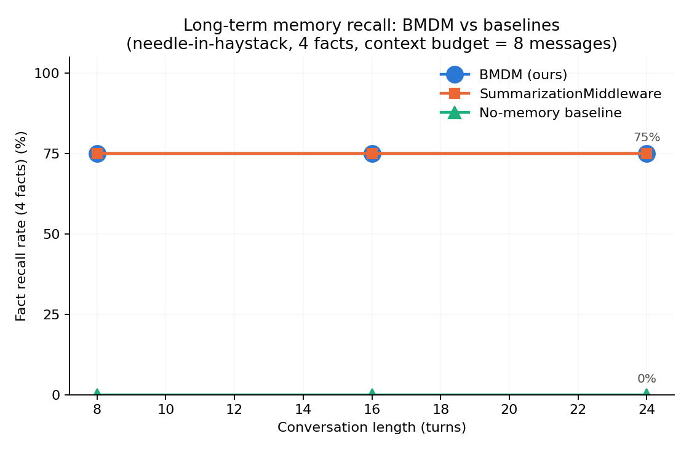
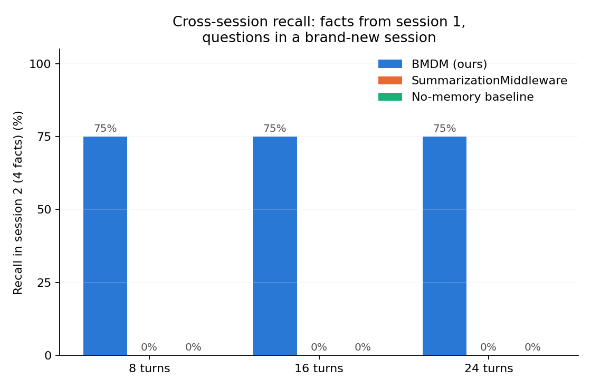
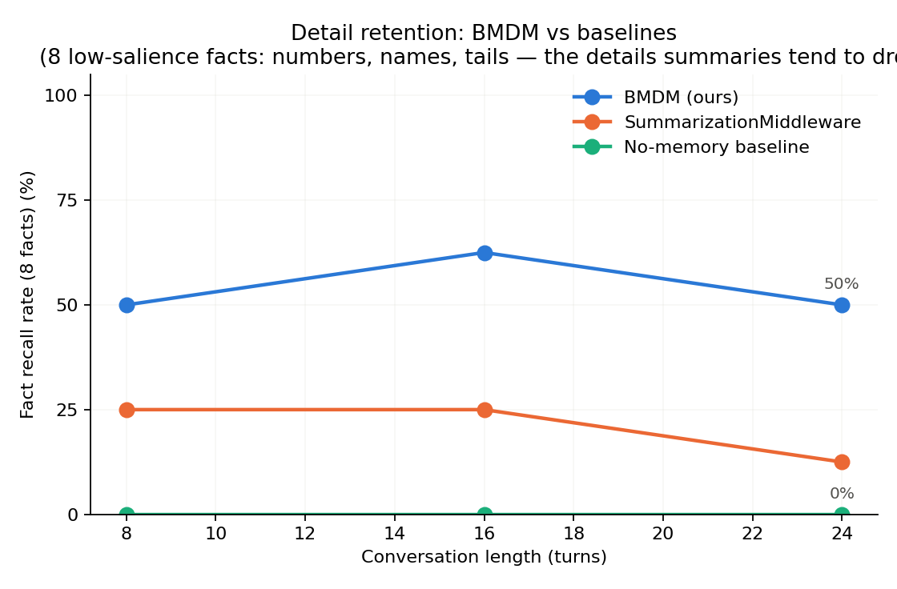

# BalancedMultiDimensionMemory

A **LangGraph `AgentMiddleware`** that gives LLM agents long-term memory — powered by Ebbinghaus forgetting curves, multi-dimensional weighted scoring, LLM-driven parameter tuning, and incremental user-profile consolidation.

> Extracted as a standalone package from the production project [fireflymall-ai-customer-service](https://github.com/fufuxiaokeai/fireflymall-ai-customer-service). Works offline out of the box — **zero external services required** for tests and demo; Redis / RabbitMQ / real embeddings are optional plug-ins.

---

## Why

Standard chat contexts forget. The official `SummarizationMiddleware` compresses old turns into a summary — useful, but it loses retrievable detail and doesn't build a *user model*. This middleware implements a **three-layer memory** designed around how human memory actually works:

```
┌────────────────────────────────────────────────────────────────────┐
│ 1. Working memory (short-term)                                     │
│    timestamped message list — the live conversation                │
└──────────────────────────┬─────────────────────────────────────────┘
                           │  maturity M(Δt) ≥ threshold  (Ebbinghaus)
                           ▼
┌────────────────────────────────────────────────────────────────────┐
│ 2. Staging store (mid-term) — vector RAG                          │
│    dialogue slices with metadata: theme / type / time /            │
│    strengthen_count. Retrieved on demand, strengthened on reuse.   │
└──────────────────────────┬─────────────────────────────────────────┘
                           │  cursor-based incremental summarization
                           ▼
┌────────────────────────────────────────────────────────────────────┐
│ 3. Long-term store — structured user profile (UserProfile)         │
│    facts / preferences / goals / constraints ... written per user  │
└────────────────────────────────────────────────────────────────────┘
```

When the context budget is approached, the middleware retrieves the most relevant slices and injects them **into the system prompt** (core → profile → fragments, ordered for KV-cache-prefix friendliness), then truncates the raw history — keeping context bounded while the important facts survive.

## The math

| Quantity | Formula | Meaning |
|---|---|---|
| Maturity | `M(Δt) = 1 − exp(−(Δt/τ_m)^c_m)` | when the oldest message is "ripe" → slice it |
| Time decay | `T(m) = exp(−(Δt/τ)^c)` | Ebbinghaus forgetting curve; τ ≈ time to 37% strength |
| Importance | `F(m) = clamp(w₀ + w₁·Σ(vᵢ·I_type(i)) + w₂·(1−exp(−refresh·k)), 0, 1)` | inherent value by memory type + consolidation count |
| Relevance | `R(m, q) = max(0, cos(m, q) − θ_min)` | semantic fit to the current topic |
| Score | `S(m) = α·R + β·T + γ·F + δ` | ranking for top-K injection |

α/β/γ/δ and w₀/w₁/w₂ are **re-tuned by the LLM per conversation theme** (structured output, α+β+γ=1, w₀+w₁+w₂=1), so weighting adapts to what the user is talking about.

## Quickstart

```bash
pip install memory-middleware           # from PyPI
# or from source:
git clone https://github.com/fufuxiaokeai/memory-middleware.git && cd memory-middleware
pip install -e ".[dev]"
python examples/quickstart_offline.py   # fully offline, scripted models
pytest                                  # 79 offline tests, no services, <1s
```

To use with a real model (DeepSeek):

```python
from memory_middleware import BalancedMultiDimensionMemory, MemoryConfig

memory = BalancedMultiDimensionMemory(MemoryConfig.from_vocation('customer service'))

agent = create_agent(
    model, tools,
    middleware=[memory],                 # same slot as SummarizationMiddleware
)
```

Runtime requirements: `runtime.context.user_id` (or `state['user_id']`), `runtime.store` (any LangGraph store, e.g. `InMemoryStore`), and state channels `messages` / `new_msg_idx` / `user_profile` / `system_prompt`.

**Message timestamps are self-contained**: any message missing the `time` field is
stamped automatically on first sight (treated as "now"), so the Ebbinghaus maturity /
decay machinery works with no external ingestion hook. Existing timestamps are never
overwritten — **for exact timestamps, stamp at ingestion in your own pipeline (the
upstream pattern); an external stamp always wins**. The fallback's bias is
conservative: unknown age is treated as "now", which delays (never accelerates)
slicing/decay/consolidation. A debug log records every fallback stamp. (The upstream
project also stamps at its message-entry node; both are idempotent and can coexist.)

See `examples/quickstart_real.py` for a complete harness with **token & cost tracking** (≈ ¥0.003 / 4-turn conversation on deepseek-v4-flash).

## Dependency decoupling

Everything external is an **injectable narrow protocol with an offline default** — the test suite and demo run with zero services:

| Concern | Protocol / injection point | Offline default | Production plug-in |
|---|---|---|---|
| Fragment id cursor | `KVStore` (`aget`/`aset`) | `MemoryKVStore` (in-process) | `RedisKVStore` (atomic, multi-process) |
| Failure recovery | `ErrorRecovery` (`on_split_error` / `on_summary_error`) | `NullRecovery` (log only) | `RabbitMQRecovery` (durable queue + optional notifier) |
| Embeddings | langchain `Embeddings` | `HashEmbeddings` (deterministic, offline) | DashScope / OpenAI / Ollama |
| Vector store | `VectorStore` interface | `SQLiteVecStore` (local file / `:memory:`) | Milvus / ES via the same interface |
| Chat / split / summary / tuning models | model instances or `model_factory` | scripted fakes | any `init_chat_model` provider (DeepSeek, OpenAI, …) |
| Token counting | `TokenCounter` | chars/3.3 heuristic | tiktoken / transformers / provider usage |
| Base system prompt | `MemoryConfig.initial_prompt` | — | app-provided prompt |

Honest limitations (documented, not hidden):
- `MemoryKVStore` is single-process only — use `RedisKVStore` for multi-process deployments.
- `NullRecovery` drops failed slice/summarize payloads (the round is skipped, the agent keeps working) — attach `RabbitMQRecovery` if you need retries.
- `HashEmbeddings` has low semantic quality — swap in a real embedding model for production recall.

## Testing strategy

**Offline suite (default `pytest`, no API keys):**
- Layer 0 — pure math: Ebbinghaus formulas, clamp/constraints, profile merging, scope parsing, prompt ordering
- Layer 1 — component tests with fake LLMs + in-memory stores: slicing flow, incremental summary (cursor never rewinds), retrieval injection, cross-user isolation, degradation paths, concurrent access
- The concurrency test caught a real bug (shared sqlite connection racing across users) that also existed in the original project

**Integration suite (`pytest -m integration`, requires `DEEPSEEK_API_KEY`):**
- End-to-end pipeline with the real model: slices land, profile is written, fragments are injected, answers mention early facts
- Token & cost tracking per call — using the official `usage.prompt_cache_hit_tokens / prompt_cache_miss_tokens` fields, priced at current DeepSeek rates (¥0.02 / ¥1 / ¥2 per 1M tokens; configurable via `memory_middleware.cost`)

## Measured results

All numbers below are from actual runs, not estimates. Cache accounting uses DeepSeek's
official billing fields `usage.prompt_cache_hit_tokens / prompt_cache_miss_tokens`
(¥0.02 per 1M for cache-hit input, ¥1.0 for miss, ¥2.0 for output — configurable in
`memory_middleware/cost.py`).

**Offline suite** — 79 tests, ~1 s, zero services, zero API keys.

**End-to-end with real DeepSeek (deepseek-v4-flash), 4-turn conversation**
(integration test `tests/integration/test_cost_tracking.py`, run 2026-08-16):

| Metric | Value |
|---|---|
| LLM calls | 13 — of which **4 are main-agent chat calls** (the conversation loop) and **9 are middleware-internal calls** (theme slicing / incremental summarization / parameter tuning) |
| Input tokens | 8,276 |
| Output tokens | 1,009 |
| Average cache hit rate | 62.1% (middleware-internal slice/summary calls: 86–93%) |
| Total cost | ¥0.0033 |

Per-call accounting comes from the official `usage` fields, priced at ¥0.02 / ¥1 / ¥2
per 1M tokens (`memory_middleware/cost.py`). The main-agent and the middleware-internal
calls are mixed in the same collection run; both go through the same usage collection
handler (see `tests/integration/conftest.py`).

**Recall evidence** — after 5 real turns (name + hobby stated in turn 1), the final
reply of the **main-agent chat call** was:

> 张三先生，我记得您上次提到游泳爱好。考虑到您的运动场景，我为您推荐 IP68 防水手机…

### Three-way comparison (needle-in-haystack)

Harness: `benchmarks/three_way_recall.py` (deterministic facts + filler + questions,
same conversation text for all three configs, context budget = 8 messages, real
DeepSeek + DashScope embeddings). Fact recall = answer contains the fact keyword.

| Conversation length | No-memory baseline | SummarizationMiddleware | BMDM |
|---|---|---|---|
| 8 turns | 0/4 | 3/4 | 3/4 |
| 16 turns | 0/4 | 3/4 | 2/4 |
| 24 turns | 0/4 | 3/4 | 3/4 |



Input cost at 24 turns: baseline 3,582 tokens / 31 calls · Summarization 11,809 /
40 · BMDM 66,751 / 99 (~3× Summarization — the price of the three-pass
slice/summarize/chat architecture).

### Cross-session recall (the dimension the within-session benchmark cannot see)

SummarizationMiddleware's summary lives in the session state — a **brand-new thread
starts with nothing**. BMDM persists fragments + profile in the store. Session 1
states facts, session 2 (new thread, warm-up turns + the same 4 questions) asks:

| Session-1 length | No-memory baseline | SummarizationMiddleware | BMDM |
|---|---|---|---|
| 8 turns | 0/4 | 0/4 | **3/4** |
| 16 turns | 0/4 | 0/4 | **3/4** |
| 24 turns | 0/4 | 0/4 | **3/4** |



Honest reading:
- Without a cross-session mechanism, a new session recalls **nothing** — both baselines
  are 0/4 at every length, exactly as designed.
- BMDM recalls 3/4 in a brand-new session (name/occupation/hobby via the persisted
  profile; the "Wednesdays busy" constraint is captured in the profile but not
  surfaced in the answer — same constraint-detail gap seen within-session).
- Characteristic worth knowing: memory injection only engages once the window reaches
  the trigger threshold (8 messages) — the first turns of a new session run without
  injected memory, by design.
- Observed data-quality issue: the incremental profile merge dedups exact duplicates
  only, so `user_constraints` accumulated ~7–14 paraphrases of the same constraint
  across slices (semantic-dedup or list capping is a future improvement).

### Detail retention (the "summaries lose specifics" claim, measured)

8 low-salience details (pet name, order number, card tail, birthday, phone model,
free-time window, favorite food, address) stated early, then queried one by one:

| Conversation length | No-memory baseline | SummarizationMiddleware | BMDM |
|---|---|---|---|
| 8 turns | 0/8 | 2/8 | **4/8** |
| 16 turns | 0/8 | 2/8 | **5/8** |
| 24 turns | 0/8 | 1/8 | **4/8** |



Honest reading:
- The summary's recall of specifics **declines with length** (2→2→1): compression
  drops low-salience details as the conversation grows.
- BMDM holds ~4–5/8: fragments are stored **verbatim** and stay retrievable; the gap
  widens with conversation length.
- Both mechanisms miss the pure-number details (order number / card tail / birthday /
  free-time window): summaries drop them, and BMDM's theme-gated retrieval does not
  reliably surface them (a real boundary, not hidden).
- Cost at 24 turns: baseline 5,492 tokens/40 calls · Summarization 15,842/52 · BMDM
  90,270/128 — detail retention costs ~6× Summarization at this scale.

Honest reading:
- With a strict 8-message budget, the **no-memory baseline forgets everything** —
  facts stated at turn 1 are simply gone.
- Both memory mechanisms hold ~75% recall; at 16 turns BMDM dipped to 50% (one fact
  lost to retrieval variance — single-sample noise at this scale).
- Both mechanisms lose the *same* fact (a "Wednesdays are busy" constraint): summaries
  drop such details, and the profile constraint field is not reliably filled.
- BMDM's distinguishing value is beyond this short-horizon chart: a **per-user
  structured profile + theme-retrievable fragments** (vs an opaque summary string),
  and cross-session persistence. First pass, single sample per length — larger
  samples / longer conversations would sharpen the separation.
- Data file: `benchmarks/output/recall_results.json` (regenerate the chart with
  `python benchmarks/three_way_recall.py --chart-only`).

**Recall evidence** — after 5 real turns (name + hobby stated in turn 1), the final
reply was:

> 张三先生，我记得您上次提到游泳爱好。考虑到您的运动场景，我为您推荐 IP68 防水手机…

### Why the middleware calls carry no conversation history (measured)

A design decision that looks counter-intuitive — adding history *raises* the cache hit
rate but *raises* the bill. Measured on deepseek-v4-flash, 8 groups × 6 calls,
input-cost ratios (B = carrying an "ignore" history prefix, A = stateless baseline):

| Call type | Cold regime (first write) | Warm replay (pre-warmed cache) |
|---|---|---|
| Math tuning | B/A = 1.82× | 0.59× |
| Slice | B/A = 1.89× | 0.71× |
| Summary | B/A = 2.30× | **1.90×** |

- **Cold regime** (the production reality: conversation content never byte-repeats —
  the middleware processes disjoint increments): every history token is paid at full
  price on first write, then at the discounted read price. B always loses.
- **Warm replay** (identical requests re-sent within the cache TTL): history amortizes
  and B can win *while the history stays short* — but production history grows without
  bound, so the 2% read cost grows with it.
- **The trap**: in the warm run, B-summary reached a 93.3% hit rate vs A-summary's 0%,
  yet still cost 1.9× more. **Hit rate is not cost.**
- Measured cache mechanics: DeepSeek caches in 128-token units from the start; the
  final unit bills at full price even for byte-identical input.

Conclusion: the three middleware calls stay stateless; the KV-cache-prefix thinking is
applied where it pays — the static system prompts (cached across calls and users) and
the main chat loop's growing history.

## Configuration

Key fields of `MemoryConfig` (see `memory_middleware/config.py` for all):

| Field | Default | Meaning |
|---|---|---|
| `model_name` / `model_kwargs` | `deepseek-v4-flash` | model used by the three internal calls |
| `vocation` | customer service | τ_m / τ / c / thresholds presets (collaborative creation / customer service / accompany / custom) |
| `pattern` / `trigger_threshold` | fraction / 0.8 | when retrieval injection fires (fraction of context budget, token count, or message count) |
| `rag_db_path` | `memory_fragments.db` | local sqlite file (`:memory:` allowed) |
| `retrieve_k` / `top_k` | 6 / 3 | candidates retrieved → top-K injected |

## Upstream project

This package is a decoupled extraction of the memory middleware that powers
[fireflymall-ai-customer-service](https://github.com/fufuxiaokeai/fireflymall-ai-customer-service)
— a production intelligent customer-service agent (LangGraph + DeepSeek). The upstream
repo contains the business-coupled version (Redis / RabbitMQ / DashScope wiring) plus
the reproducible cache-rate benchmark (`bench_cache_rate.py`) whose results are shown above.

### Standalone vs upstream — what you lose

This package is a **decoupled subset**, not a superset. Before using it in production,
know the differences:

| Concern | This package (offline default) | Upstream production wiring |
|---|---|---|
| Failure recovery | `NullRecovery` — failed rounds are skipped | RabbitMQ durable queues + email alerts (`memory_rag.py`) |
| Fragment cursor | `MemoryKVStore` — single process only | Redis (multi-process safe) |
| Embeddings | `HashEmbeddings` — offline, low semantic quality | DashScope `text-embedding-v4` |
| Token counting | chars/3.3 heuristic | tiktoken / transformers |

The full production implementation lives in the upstream repo at
`Tools/middleware/memory/time_memory.py` (BalancedMultiDimensionMemory),
`memory_rag.py` (spliter / incremental summary / RabbitMQ recovery) and
`Tools/middleware/compose.py` (middleware onion-chain composition). If you need
production-grade resilience, either use the upstream project directly or plug the
matching implementations into the injection points here.

## License

MIT
